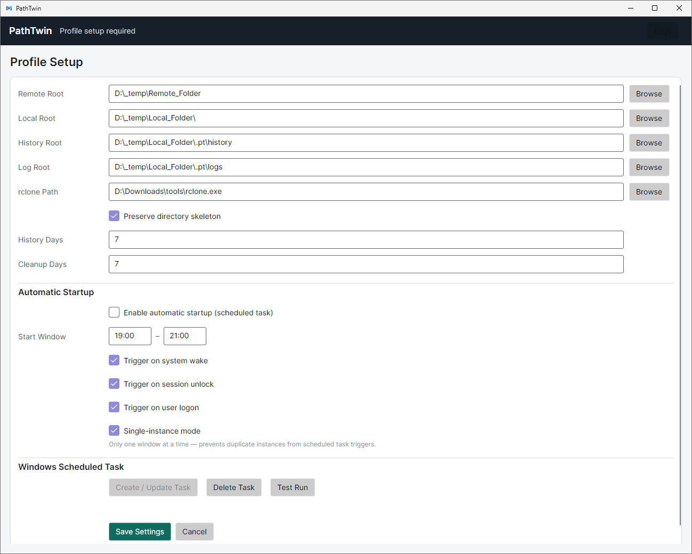
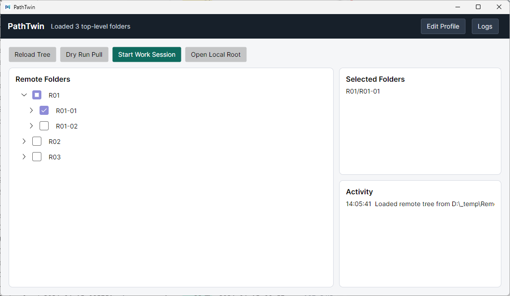
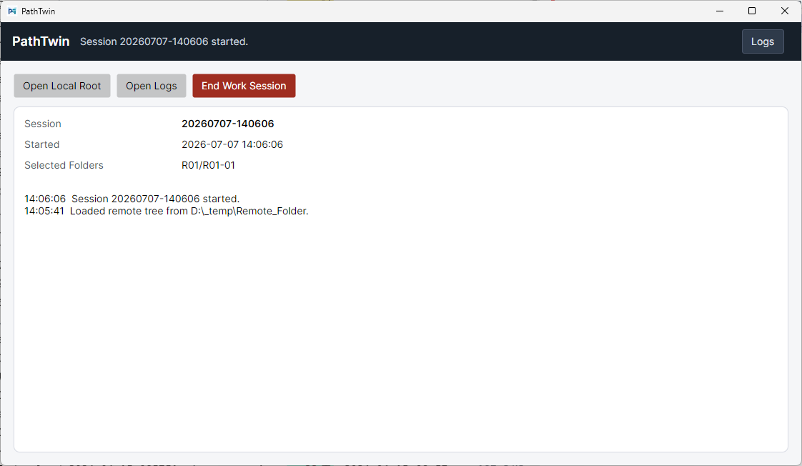

# PathTwin

<p align="center">
  
</p>

PathTwin is a Windows-first desktop app for selective, session-based folder synchronization.

It is not meant to mirror an entire drive. The app is built around a work session: choose a remote root, choose a local root, select only the folders needed for this session, pull them locally with their relative paths preserved, work locally, then end the session and safely push changes back.

## Screenshots

**Profile setup**



**Selective pull**



**Active session**



## Current MVP

- Avalonia UI on .NET 8
- JSON configuration under the user profile
- One active profile, with config shaped for multiple profiles later
- Lazy-loaded remote directory tree for local/SMB paths
- Three-state checkbox folder selection (checked / unchecked / partial)
- Configurable shallow local skeleton depth, defaulting to 2
- Start Work Session pull with real-time progress
- Start Work safety guard for unfinished previous sessions
- Unselected stale local cache cleanup sent to the Windows Recycle Bin after skeleton comparison
- Add Folder / Resume Sync during an active session, with prior selections locked
- End Work Session push with three-way planning and real-time progress
- Session manifest saved under `<localRoot>.pt\sessions`
- Remote backup before overwrite/delete (`overwritten/`, `deleted/`, `uploaded/` buckets)
- Version history auto-cleanup (configurable retention days)
- Unselected non-empty skeleton folders: update-only push; empty skeleton folders are ignored
- Basic conflict/error window and logs
- Single-instance guard
- Windows scheduled task with multi-trigger support (logon + session unlock)
- `--auto` argument handling with time-window and reachability checks
- Auto-startup settings in profile UI
- Optional rclone executable path, with native file-system fallback
- Application icon (rounded, 1000×1000)

## Changelog

### v0.1.6

**Start Work cleanup**
- Start Work cleanup now sends stale unselected local cache items to the Windows Recycle Bin instead of moving them into `.pt\trash`.
- Cleanup now runs after selected remote files are scanned and the shallow skeleton is compared.
- Existing skeleton directories that still belong to the current remote skeleton are preserved, avoiding unnecessary delete-and-recreate work.
- Removed the local trash setting from the active profile model; older config files with that field remain readable.

### v0.1.5

**Start Work safety**
- Start Work now checks the latest previous session before any local cleanup.
- Cleanup continues only when the previous session is `Completed`, or when no previous session exists.
- `Active`, `Failed`, and `Interrupted` previous sessions block cleanup and show a warning so unpushed local changes are not hidden.
- Session JSON now records a `Status` field while remaining compatible with older session files.
- Edit Profile now returns to the active session view after Cancel, or after saving non-session settings.
- Saving session-affecting profile changes during an active session first ends that session with the original profile settings, then returns to folder selection.
- Sync progress detail now keeps a fixed single-line height so the activity log does not jump when file or folder names vary.

**Local cache cleanup**
- Before the normal skeleton recreation and selected-folder pull, unselected old local cache content is moved to local trash.
- Selected folders are preserved for the existing remote-to-local pull, and ancestor directories are kept only as needed.
- Cleanup preserves app metadata folders, validates paths stay under the local root, and avoids following reparse points during enumeration.

### v0.1.4

**Session workflow**
- Added configurable `SkeletonDepth` for shallow local folder skeleton creation.
- Start Work records `InitialSelectedPaths` and creates only the configured skeleton depth before pulling selected folders.
- Added Add Folder mode during an active session, with existing session folders checked and locked.
- Added Resume Sync to pull only newly selected folders and append them to the active session.

**Final push behavior**
- End Work now categorizes local folders into selected mirror-push folders, unselected non-empty update-only folders, and ignored empty skeleton folders.
- Selected folders keep the existing conflict planning and remote backup behavior before overwrites/deletes.
- Unselected non-empty folders use copy/update behavior and never mirror-delete remote files.
- rclone uses `sync` for selected folders and `copy` for unselected update-only folders.

**Manifest and logs**
- Session JSON records skeleton depth, initial selections, added selections, selected paths, session events, added pull logs, and final push log.
- Push logs include a categorized plan with selected folders, update-only folders, and an empty skeleton folder count.

**UI and docs**
- README now includes the app logo and screenshots.
- Header buttons keep clear contrast in normal, hover, pressed, and disabled states.

### v0.1.3

**Sync progress & responsiveness**
- Pull (Start Session) now shows real-time progress: files scanned, skeleton directories created, folders pulled — each with live per-file/per-dir updates and a determinate progress bar.
- Push (End Session) same treatment: scanning, planning, executing all report live progress.
- Skeleton creation offloaded to background thread via `Task.Run` — UI no longer freezes during large remote tree enumeration.
- Progress detail is a single updating line below the bar; activity log only records milestones, not every file.

**Unselected folder optimization**
- Push now skips empty skeleton directories entirely (single-pass file enumeration instead of N+1 directory+file checks).

**UI / UX**
- Settings page is scrollable.
- Header buttons are styled for visibility on dark banner.
- "Edit Profile" button removed from toolbar (kept in header only).
- All progress text unified to "Synchronizing" / "Syncing" terminology.
- Checkboxes default to unchecked on load; last session selections are remembered and restored on next launch.

**Config & defaults**
- History root now defaults to `<LocalRoot>.pt\history` alongside `<LocalRoot>.pt\logs`.
- Local root Browse picker always refreshes Log and History roots to defaults.
- All `.pfs` references replaced with `.pt`.
- `.pt` folders excluded from all sync operations (tree, scanner, skeleton).
- Metadata folder name centralized in `AppConstants.LocalMetadataDirName`.

**Windows Task Scheduler**
- Task creation now uses multi-trigger support: `AtLogOn` + session unlock (via CIM).
- `--auto` argument handling: time-window check, remote reachability check, diagnostic log at `%TEMP%\PathTwin\auto_launch.log`.
- UAC elevation via `runas` verb with clear error messaging.

**Build & packaging**
- Version bumped to 0.1.3.
- Application icon added (rounded PNG + embedded .ico).
- Package script creates standalone, compressed single-file Windows executables only.

### v0.1.2
- Lazy-loaded directory tree (top-level only on startup, expand to load children).
- Multi-trigger scheduled task support.
- `.pfs` → `.pt` migration.
- Settings scroll and header button styling fixes.
- Checkbox three-state refinement (user toggle only checked/unchecked, indeterminate auto-calculated).

### v0.1.1
- Initial public MVP: Avalonia shell, profile config, tree with checkboxes, pull/push with version backup, single-instance, scheduled task entry point.

### v0.1.0
- Initial scaffolding and core sync engine.

## Repository Layout

```text
src/PathTwin.App/              Avalonia desktop app
src/PathTwin.App/Backends/     rclone/native backend wrappers
src/PathTwin.App/Sync/         scanning, planning, execution, history cleanup
src/PathTwin.App/Platform/     shell, single-instance, Task Scheduler helpers
src/PathTwin.App/Models/       config/session/sync data models
tools/iconprocessor/           local tool for regenerating app icons
assets/icon-source.png         original icon source image
icon.png                       final 1000x1000 transparent PNG icon
tools/rclone.exe               optional local binary, ignored by Git and not packaged by default
```

## Build

Requirements:

- .NET 8 SDK or newer
- Windows for the full desktop/runtime experience

```powershell
dotnet restore src/PathTwin.App/PathTwin.App.csproj
dotnet build src/PathTwin.App/PathTwin.App.csproj
```

## Run

```powershell
dotnet run --project src/PathTwin.App/PathTwin.App.csproj
```

## rclone

PathTwin does not bundle `rclone.exe` in the public release package. Users who want to use rclone can download it from the official rclone downloads page and choose the executable path in Settings:

- https://rclone.org/downloads/

rclone's own downloads page describes rclone as a single executable, `rclone.exe` on Windows, distributed as a zip archive that can be extracted anywhere.

## Publish Windows Standalone

```powershell
scripts/package-release.ps1 -Version 0.1.6
```

The release script creates standalone, self-contained executables that do not require adjacent DLL files:

- `artifacts/PathTwin-0.1.6-win-x64.exe`: versioned release executable
- `artifacts/PathTwin-latest-win-x64.exe`: stable latest executable name

## License

PathTwin is licensed under the Apache License, Version 2.0. See [LICENSE](LICENSE).

PathTwin can use rclone as an optional external tool, but the public release package does not redistribute `rclone.exe`. See [THIRD_PARTY_NOTICES.md](THIRD_PARTY_NOTICES.md).

## Documentation

- [Architecture](docs/ARCHITECTURE.md)
- [Release checklist](docs/RELEASE_CHECKLIST.md)
- [rclone binary policy](docs/RCLONE.md)
- [Icon workflow](docs/ICON.md)
